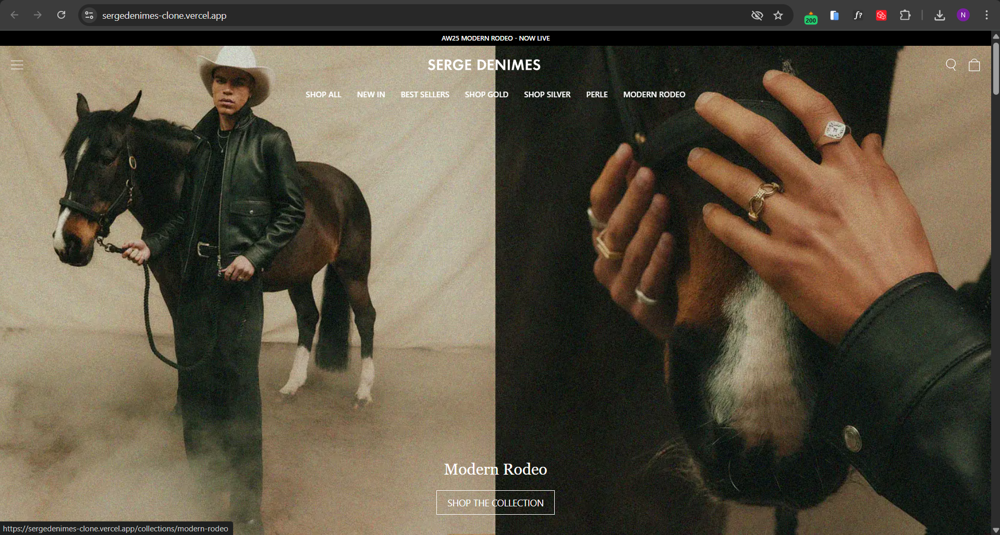

# Serge DeNimes Landing Page Clone

This project is a **clone of the landing page** of [Serge DeNimes](https://www.sergedenimes.com/) built using **Next.js** and **TypeScript**. The goal of this project was to replicate the layout and design as closely as possible while following modern frontend development practices.

## 🚀 Live Demo

👉 [View Live on Vercel](https://sergedenimes-clone.vercel.app/)

## 📂 Tech Stack

- **Next.js** (App Router)
- **TypeScript**
- **Tailwind CSS**
- **Responsive Design**
- **Vercel** for deployment

## 📸 Screenshots



## 🛠️ Features

- Fully responsive layout
- Pixel-perfect design matching the reference website
- Modern and clean code structure
- Hosted and deployed on Vercel

## 📝 How to Run Locally

1. Clone the repository:

   ```bash
   git clone https://github.com/niketvns/sergedenimes_clone.git
   ```

2. Navigate to the project directory:

   ```bash
   cd sergedenimes_clone
   ```

3. Install dependencies:

   ```bash
   npm install
   ```

4. Start the development server:

   ```bash
   npm run dev
   ```

5. Open [http://localhost:3000](http://localhost:3000) in your browser.

## 📢 Feedback

If you have any feedback or suggestions, feel free to open an issue or contact me directly.
